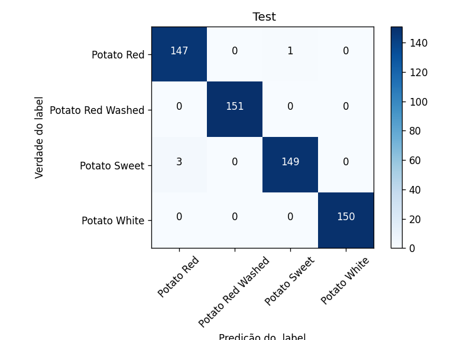

# Potato Classification Using CNN_Mixup


By [Luiz H. Buris](http://),[Luiz H. Buris](http://),[Luiz H. Buris](http://)

## Introdução

xxxxxxxxx


## Code organization

- `object_detector_opencv.py`: .


## Train
you can now carry out "run" the python scrypt with the following command:

```sh
python3 object_detector_opencv.py

```

## Resultado
99,334% on test.

<p align="center">
</img>
</p>
