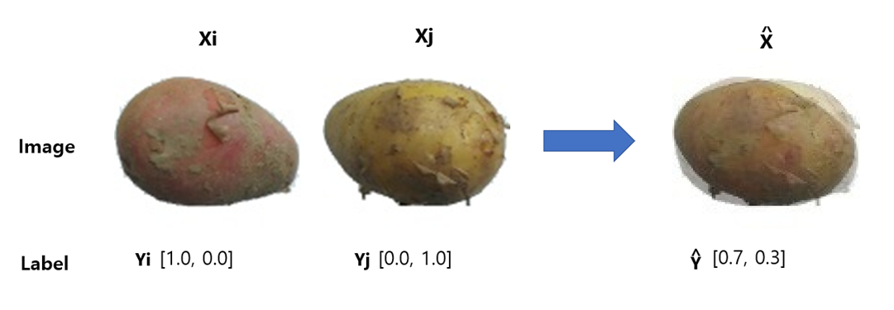
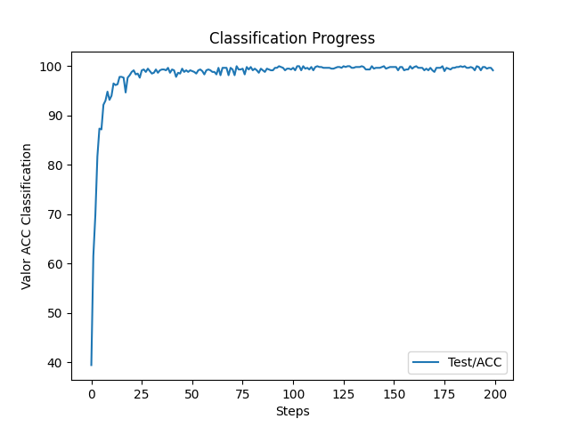

# Potato Classification Using CNN_Mixup -------> Em Desenvolvimento


By [Luiz H. Buris](http://),  [XXX yyy](http://) [Joel F. H. Quispe](http://)


## Introdução

xxxxxxxxx


## Citation

If you use this method or this code in your paper, then please cite it:

```
@article{XXXXXXXXXX,
  title={XXX},
  author={Luiz H Buris, Joel F. H. Quisp, Miguel Sá},
  journal={arXiv preprint arXiv:XXXX.XXXXX},
  year={20XX},
  url={https:https://arxiv.org/pdf/XXXX.XXXXX.pdf},
}
```

## Mixup CNN on training

<p align="center">
</img>
</p>

## Image segment classification on train model.

Amostra  |  SAM Teste
:-------------------------:|:-------------------------:
 |   

## Code organization

- `train.py`: .........

## Train
you can now carry out "run" the python scrypt with the following command:

```sh

python3 train.py --train_dir '/train' --test_dir '/test' --lr=0.0001 --seed=202210023 --decay=1e-4 --batch_size 32 --epoch 200

```

## Resultado
 Média 99.75% on test.

## Confusion Matrix 

Fold1   |  Fold2 | Fold3   |  Fold4 
:-------------------------:|:-------------------------:|:-------------------------:|:-------------------------:
 |   |   |   


## Graphic Train, Loss, test classification


Train   |  Loss 
:-------------------------:|:-------------------------:
 |   


<p align="center">
</img>
</p>
